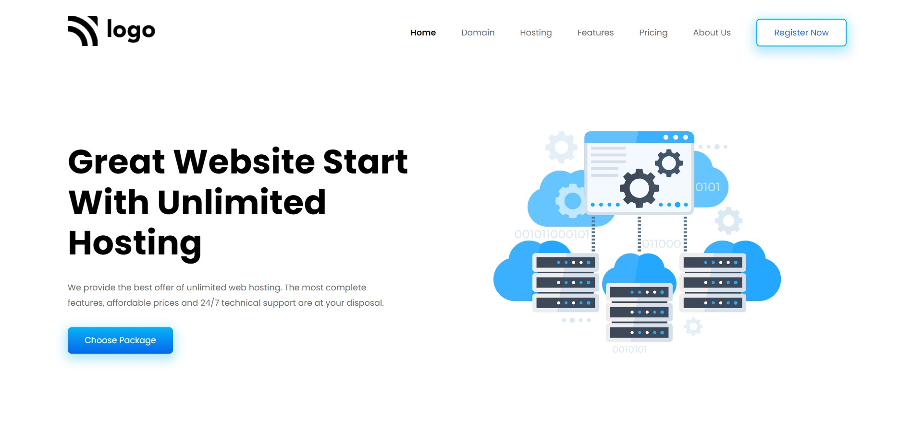

# Project 2 - with HTML and CSS

by Divesh Thakre

 

[Deployed link ](https://divesh11.netlify.app/)

## what concepts i Learned by Creating this website?

- This project was fun i used some grid flex-box.
* Making page Responsive using Media Querries.
- Planing Html for css .
- learned to plan layouts.
* learned to position html elements.
* creating multi column Footer.

### Time Taken For this project is around 7.5 hrs.
